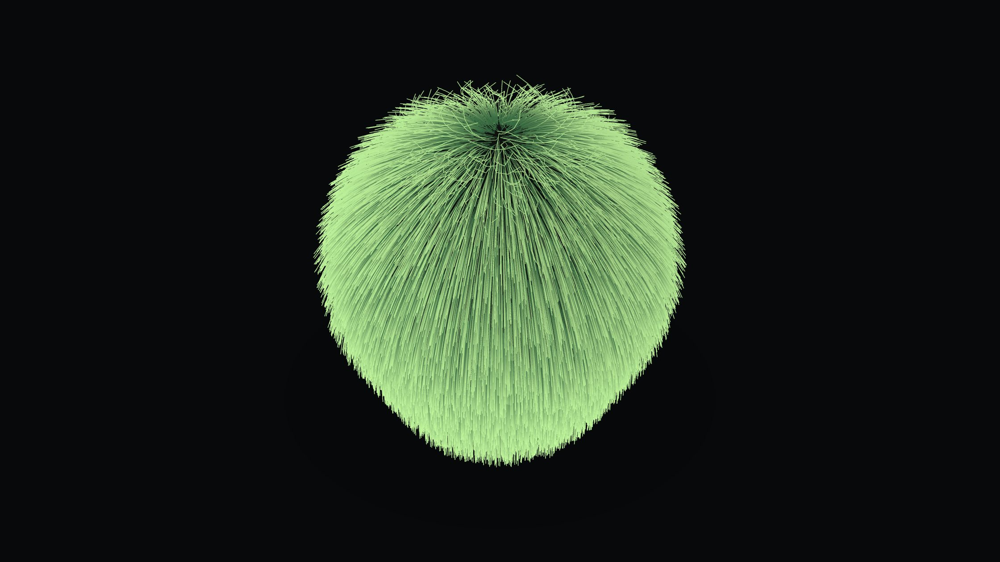

# Marimo Wallpaper

A calm, fuzzy, living hairy ball for **Wallpaper Engine** — a Three.js
recreation of the [Marimo](https://oimo.io/works/marimo/) sketch by
[saharan](https://github.com/saharan). Verlet-integrated hair strands on a
slowly rotating sphere, with multiple color modes, soft idle motion,
optional mouse interaction, and tunable density.



---

## What this is

A self-contained **web wallpaper**: HTML + CSS + JavaScript + a locally
bundled copy of Three.js. No CDNs, no network at runtime, no Node required
to actually run it.

- Three.js scene with a single `LineSegments` mesh holding **all** strands.
- CPU verlet integration on `Float32Array` buffers (8-segment strands by
  default; ~3.5k to 32k strands depending on the quality preset).
- Distance + volume + max-length constraints, mirroring the original
  GPU-texture solver.
- Color modes: natural moss green, RGB "FEVER" rainbow, blue/cyan,
  purple/pink, or two user-picked custom colors.
- Wallpaper Engine user properties for every visible knob.

## File layout

```
marimo-wallpaper/
├── index.html                 entry point — Wallpaper Engine loads this
├── style.css                  full-screen, no chrome
├── project.json               Wallpaper Engine manifest (properties live here)
├── package.json               optional npm helpers for dev — not required
├── LICENSE                    MIT
├── README.md                  this file
├── lib/
│   └── three.min.js           bundled Three.js r160 (the deprecation banner
│                              has been stripped for a clean wallpaper console)
└── src/
    ├── main.js                bootstraps everything, runs the rAF loop
    ├── MarimoBall.js          central sphere body + rotation
    ├── FurSystem.js           hair simulation + LineSegments rendering
    ├── WallpaperEngineProperties.js   property listener glue
    ├── PerformanceLimiter.js  FPS limiter / EMA FPS tracker
    ├── scene/
    │   └── setupScene.js      renderer / camera / lights / fitCamera
    └── util/
        ├── fibonacci.js       even sphere distribution
        ├── noise.js           cheap sinusoidal wind
        └── colorModes.js      color presets + Wallpaper-Engine color parser
```

## Run in a browser (dev)

Two equally good options.

**Option A — just open the file.** Double-click `index.html`. The classic
`<script>` tags mean it works straight from `file://`.

**Option B — local static server.** If your browser blocks any local read
(rare with classic scripts, but possible with strict policies):

```bash
npm run dev
# then open http://localhost:5173
```

`npm run dev` runs a tiny zero-dependency Node server (`.dev-server.js`).
You can also run it directly with `node .dev-server.js` if you don't have
npm. Either way the server only listens on `127.0.0.1`.

Press **D** in the browser window to toggle the debug overlay (FPS, hair
count, DPR, resolution).

## Build

There is no build step. The project ships as static files. Whatever lives
in this folder is what Wallpaper Engine consumes.

If you ever want to inline everything into a single file for distribution,
you can use any static bundler (esbuild, rollup, etc.), but it's not
necessary.

## Import into Wallpaper Engine

1. Open **Wallpaper Engine**.
2. Click **Open Wallpaper Editor**.
3. Choose **Create Wallpaper**.
4. Pick **Web Wallpaper**.
5. When asked for the source folder / HTML file, point it at this folder's
   **`index.html`**.
6. Wallpaper Engine copies the folder into its own `projects` directory.
7. Set a name and preview image (drop a `preview.jpg` into the folder
   first if you want a custom one).
8. Save. The wallpaper appears in your "Installed" tab and can be applied
   like any other.

## Edit settings in Wallpaper Engine

Right-click the wallpaper in Wallpaper Engine and pick **Configure** (or
just open it while it's applied). Every setting below is exposed:

| Section     | Setting                     | Default  | Notes |
|-------------|-----------------------------|----------|-------|
| Quality     | Quality preset              | High     | Low (5k) / Medium (14k) / High (28k) / Ultra (45k) hairs. Picks the strand-count ceiling. |
| Marimo      | Ball size                   | 5.0      | Sphere radius in scene units. |
| Marimo      | Hair amount                 | 1.0      | Multiplier on the quality preset's strand count. |
| Marimo      | Hair length                 | 3.0      | Strand length in scene units. |
| Marimo      | Hair volume                 | 0.6      | "Puffiness" — minimum radius per segment. Lower = more gravity droop. |
| Motion      | Gravity (ball + hair)       | 0.6      | Pulls the ball *and* the hair tips downward. 0 = float in place. |
| Motion      | Auto-rotation speed         | 0.0      | Constant body spin. Default 0 (no auto-spin, matching the original). |
| Motion      | Hair wind (advanced)        | 0.0      | Ambient sinusoidal sway on the strands while the ball is still. |
| Motion      | Ball physics (bounce + move)| On       | When on, the ball is a rigid body — falls, bounces, can be grabbed. Off pins it at the origin. |
| Motion      | Ball bounce (restitution)   | 0.55     | 0 = no bounce, 0.9 = very bouncy. |
| Motion      | DVD bounce                  | Off      | Ball drifts at constant speed, bouncing off the screen edges like the DVD logo. |
| Motion      | DVD bounce speed            | 6        | Drift speed when DVD bounce is on. |
| Color       | RGB rainbow mode            | Off      | Overrides color mode with the animated "FEVER" rainbow. |
| Color       | Color mode                  | Natural  | Natural / RGB neon / Rainbow (per strand) / Blue-cyan / Purple-pink / Sunset / Fire / Ocean / Lavender / Gold / Autumn / Ice / Monochrome / Custom / Follow Windows accent / WE scheme color. |
| Color       | Color cycle speed           | 0.0      | >0 slowly rotates the hue of any palette over time. |
| Color       | Brightness                  | 1.0      | Master brightness multiplier for the whole marimo. |
| Color       | Custom color (root)         | Dark blue| Used when Color mode = Custom (dragging it auto-switches to Custom). |
| Color       | Custom color (tip)          | Light cyan| Used when Color mode = Custom. |
| Look        | Background color            | Near-black| Sets the clear color and tints the body sphere. |
| Look        | Show ground shadow          | On       | Soft vignette under the ball. |
| Look        | Camera zoom                 | 1.0      | 0.6 = wider, 1.8 = closer. |
| Look        | Glow (additive blending)    | Off      | Strand additive blending — great in dark modes, can wash out light backgrounds. |
| Interaction | Mouse interaction           | On       | Enables grab-and-throw + scroll-to-depth (see **Controls** below). |
| Interaction | Mouse breeze                | Off      | Lightly nudges the ball as you move the mouse, even without grabbing it. |
| RGB         | RGB sync                    | Off      | Off / Bottom bar / Ambilight. Edge color bars for hardware sync (see **RGB hardware sync**). |
| Audio       | Audio reactivity            | 0.0      | Master sensitivity. 0 = off. The reactions below only do anything when this is > 0. |
| Audio       | Audio: bounce               | On       | Bass jumps the ball, treble spins it. |
| Audio       | Audio: pulse                | Off      | Overall level throbs the ball's size. |
| Audio       | Audio: glow                 | Off      | Overall level brightens the fur with the beat. |
| Audio       | Audio: hair                 | Off      | Bass puffs the fur outward (stands on end on beats). |
| Debug       | Show debug overlay          | Off      | Top-left FPS / hair / position chip. |

Wallpaper Engine's own FPS setting (the *general* properties pane) is
respected automatically — `PerformanceLimiter` reads it and caps frames
accordingly. Default fallback is 60. Wallpaper Engine's **pause** signal
is also honoured: when WE pauses the wallpaper (a game/video goes
fullscreen) the simulation and rendering both stop until you return.

## Controls

When **Mouse interaction** is on:

- **Left-click + drag the ball** — grab the marimo and fling it around.
  Release to throw; it carries your drag velocity, then falls and bounces.
- **Scroll wheel over the ball** — push it toward (scroll up) or away from
  (scroll down) the camera, giving explicit control over the 3D depth axis.
- The ball is bounded by an invisible box (floor, ceiling, four walls)
  scaled to your screen, so it can never escape the frame.
- Press **D** anytime to toggle the in-page debug overlay.

## Debug inside Wallpaper Engine (CEF DevTools)

1. Wallpaper Engine → **Settings** → **General**.
2. Find **CEF DevTools port** and set it to a port (Steam's default
   suggestion is `8080`).
3. Restart Wallpaper Engine.
4. Open **Chrome** (or any Chromium browser) and visit
   `http://localhost:8080` while the Marimo wallpaper is running.
5. Pick the wallpaper page from the list. You get a full DevTools panel:
   Console, Performance, Memory, etc.

The wallpaper also accepts the keyboard shortcut **D** to toggle the
in-page debug overlay (useful for both browser and CEF).

## Performance notes

| Preset | Strands  | Approx. CPU / frame * | Approx. GPU                |
|--------|----------|-----------------------|----------------------------|
| Low    | 3,500    | ~0.5 ms               | Trivial on any GPU         |
| Medium | 10,000   | ~1.5 ms               | Light, fine on integrated  |
| High   | 20,000   | ~3 ms                 | Mid-range discrete GPU     |
| Ultra  | 32,000   | ~5 ms                 | Recommended discrete GPU   |

\* Measured on a mid-2024 desktop CPU. Your numbers will vary.

Notes:

- The simulation runs on the CPU. The GPU only draws `LineSegments`, which
  is essentially free.
- Strand count = `(quality preset max) × hairAmount slider`. Pull the
  `hairAmount` slider down if you want a lighter version of any preset.
- WebGL line width is fixed at 1 pixel on most platforms (a Three.js
  limitation, not a bug here). Strand visual density is controlled by
  count, not thickness.
- The wallpaper writes one `position` attribute upload per frame, sized to
  the active strand count — no allocations, no `THREE.Mesh` churn.
- Quality changes at runtime never reallocate buffers; only the index
  draw range changes.
- On the **Visibility** event the wallpaper pauses its frame work, so
  occluded / hidden wallpapers don't burn cycles.

## RGB hardware sync

The wallpaper can act as a **color source** for your peripherals — by syncing
the marimo's colors to your Windows accent, and letting your RGB hardware
software sample the screen.

### RGB sync edge bars (built in)

Set **RGB sync** in the configure panel:

- **Off** — no bars, no extra work.
- **Bottom bar** — a thin 6 px strip along the bottom edge, tinted to the
  marimo's current hair-tip color. Minimal visual footprint; ideal as a
  single sample region.
- **Ambilight** — bars on all four edges. Point a screen-sampler at any
  edge, or set up perimeter zones for an ambilight effect around your
  monitor.

The bars update ~30×/second from whatever color mode is active (moss
green, RGB neon, your Windows accent, a custom gradient, …). Aim your RGB
software's screen-sample region at an edge and it follows the marimo.

### Follow Windows accent color (built in)

Set **Color mode** = *Follow Windows accent* in the Wallpaper Engine
configure panel.

- The wallpaper reads the live Windows accent via the CSS `AccentColor`
  keyword (CSS Color 4). Supported in current Wallpaper Engine CEF.
- The marimo's strands gradient from a dark variant at the root to the
  full accent at the tip.
- Changes to the Windows accent are picked up within ~1 second
  automatically — no reload, no companion app.

If you switch your Windows accent in **Settings → Personalization →
Colors**, the marimo retints to match.

### Follow the Wallpaper Engine scheme color (built in)

Set **Color mode** = *Wallpaper Engine scheme color*. Wallpaper Engine
lets you pick a global "scheme color" (Wallpaper → right-click → it's
exposed in some themes / via the `schemecolor` general property). The
marimo gradients from a dark variant to that scheme color and updates
live when you change it.

### Color cycle

Any palette can slowly rotate its hue over time — raise **Color cycle
speed** above 0. Pair it with a single-hue palette (Fire, Ocean, …) for a
gentle drift, or leave it on Natural for a subtle shifting glow.

### Corsair iCUE sync

Wallpaper Engine itself doesn't drive iCUE devices directly — instead,
iCUE's own screen-sampling features pull colors from the wallpaper. Turn
on **RGB sync** (Bottom bar or Ambilight) first so there's a clean,
saturated region to sample, then:

1. Open **Corsair iCUE**.
2. Add a new **Mural** (or **Video Lighting** in newer iCUE versions).
3. Source: **Screen Sample** — point it at the bottom edge of your display
   (or the matching edge if you're using an Ambilight bar).
4. Apply the mural to your iCUE devices (keyboard, mouse, fans, strip).
5. Optionally tune the sample regions so they pick from the RGB sync bar.

Now: the marimo glows in the Windows accent (or any color mode), and iCUE
mirrors those colors onto your hardware in real time.

### Razer Chroma sync

Wallpaper Engine has built-in Razer Chroma integration — no extra steps in
this wallpaper. In Wallpaper Engine:

1. **Settings** → **Performance** (or **Plugins** in some versions) →
   enable **Razer Chroma** support.
2. Apply this wallpaper. Wallpaper Engine pipes the dominant on-screen
   colors to your Razer Synapse devices automatically.

### Aurora (third-party, cross-vendor)

If you want one unified sync covering multiple vendors (iCUE, Razer
Synapse, NZXT CAM, Logitech G HUB, etc.), the open-source
[Aurora](https://www.project-aurora.com/) project can sample the screen
and drive all of them at once. Point its screen-capture layer at an RGB
sync bar.

## Audio reactivity

Set **Audio reactivity** (master sensitivity) above 0, then enable any of
the four reaction toggles — they can be combined:

- **Bounce** — bass beats give the ball an upward impulse (it jumps with
  the kick drum); treble adds a gentle spin.
- **Pulse** — the ball's overall size throbs with the music's loudness.
- **Glow** — the fur brightens on the beat (cheap full-marimo brightness
  pulse, looks great with a dark background).
- **Hair** — bass puffs the fur outward, so the strands "stand on end" on
  heavy beats.

Sensitivity scales with the master slider (0 = off, 3 = very lively). This
uses Wallpaper Engine's `wallpaperRegisterAudioListener` API (128-bin FFT,
split into bass / mid / treble), so it only reacts inside Wallpaper Engine
— in a plain browser the hook is a harmless no-op.

## Customizing further

- **Strand segments**: edit `SEGMENTS` in `src/FurSystem.js`. 7 (the
  current value) matches the original Marimo's `HAIR_DIV-1` and is a sweet
  spot for smoothness vs. CPU. Higher looks softer but costs more.
- **Damping / stiffness / curl**: `_damping` (0.94), `_stiffness` (0.07)
  and `_curl` (0.72) in `FurSystem` shape how the fur settles — damping is
  how fast motion dies, stiffness keeps the ball round at rest, curl makes
  strands lay over into soft moss vs. straight radial spikes.
- **Per-quality strand counts**: the `QUALITY_HAIRS` map at the top of
  `src/FurSystem.js`. Increase Ultra if you have a serious GPU.
- **Adding a color mode**: append to `PRESETS` in
  `src/util/colorModes.js`, then add an `<option>` to the `colorMode`
  combo in `project.json`.

## Credits

- Effect concept and original WebGL implementation:
  [saharan / oimo.io](https://oimo.io/works/marimo/) — MIT.
- This recreation: independent rewrite in Three.js. No original assets
  bundled.
- Three.js: MIT, bundled at `lib/three.min.js`.

## License

MIT — see `LICENSE`.
